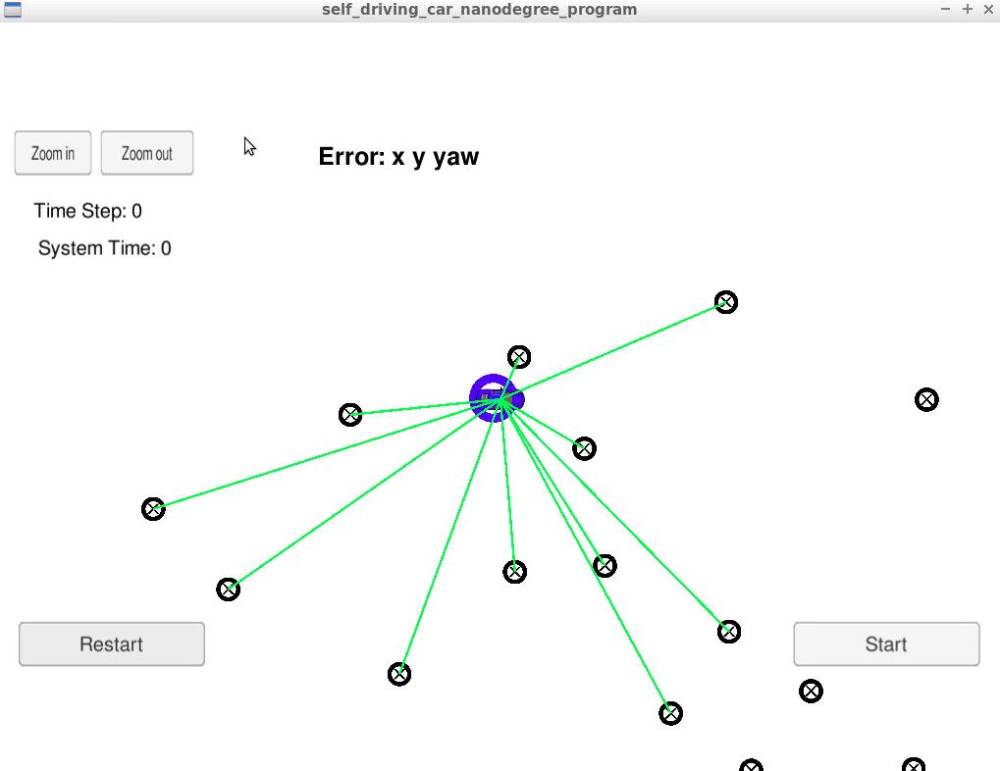
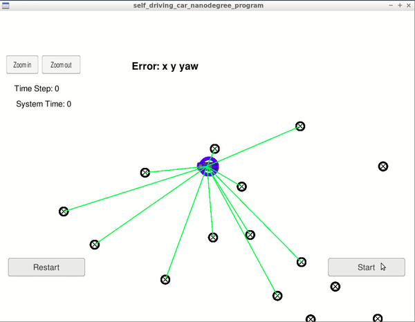

# Kidnapped Vehicle Udacity Project
This is my implementation of completing the Kidnapped Vehicle Udacity Project as part of Udacity's Self-Driving Car Engineer Nanodegree program.

## Project Introduction
The objective of this project is to try find the position of a stolen robot using an initial GPS measurement, radar data, and a map. This is to be done using a particle filter in C++ accompanied by the simulation provided by Udacity. A notable feature of this code is it's ability to take into account sensor noise/inaccuracies.  



## Localization Introduction
Localization is the process of characterizing attributes related to position and orientation of an object to a certain frame of reference. Objects in an environment can be perceived by a robot using sensors (such as cameras, lidar, radar, etc), and localized in a frame of reference relative to itself. The robot can then take it's own location and orientation relative to a known environment, to transpose this localization to one which matches a map's coordinate system. This allows for a type of localization that is more standard and universal, such as absolute GPS location (Latitude, Longitude) and absolute orientation (Angle relative North, South, East, or West, as well as relative yaw, pitch, and roll).

## Particle Filter Introduction
One of the ways which localization of a robot is implemented is by using a particle filter. A particle filter is an algorithm in which a distribution of points on a known map is generated of possible locations of the robot based on sensor measurements of the surrounding and movement of the robot. As the robot moves around and acquires more sensor data of its location, points are eliminated based off the unlikeliness that the robot is there based off the sensor data. Eventually only a small distribution of points will remain of likely positions of the robot.

The particle filter developed in this project will incorporate the following steps.

##### 1) Initialization
- Initialize all particles onto map
- Take in initial GPS coordinates
- Take into account noise/inaccuracies in GPS sensor

##### 2) Prediction
- Predict location of car at next time step
- Take in yaw rate of vehicle
- Take in velocity of vehicle
- Take into account noise/inaccuracies in yaw rate and velocity measurements

##### 3) Update Weights
- Weight each particle of likelihood of being the location of vehicle
- Utilize Gaussian probability
- Take in Map Landmark Position
- Take in measurements of landmark features
- Take into account noise/inaccuracies in yaw rate and velocity measurements

##### 4) Resample
- Repeat Steps 2 and 3 as new sensor measurements come in to continue localization of vehicle

## Implementation Of Particle Filter In C++
For this project, the Udacity simulation is used to simulate a robot moving around a known environment with simulated sensor measurements. To localize the robot in the simulation a particle filter is developed in C++. The main programming language for this project is C++ due to its nature of being highly efficient and ability to generally process more data quicker than other programming languages. Some code with functions and classes are provided by Udacity, this includes the following:
- main.cpp
  - The main code that is run with the simulation and incorporates all the other code files to localize the robot using the particle filter.
- helper_functions.h
  - Included functions and classes for helping standardize localization.
- json.hpp
  - Library used for working with JSON data types
- map.h
  - Contains the map data
- particle_filter.h
  - Used to import particle.cpp function to be used in main.cpp
- particle_filter.cpp
  - The code which implements the particle filter. This is the code which is worked on most for this project

## Running The Project
To run the project, you must first download the simulation located [here](https://github.com/udacity/self-driving-car-sim/releases). Follow the instructions and start the simulation and select the Kidnapped Vehicle Project.

Now run the following terminal commands in the project root directory:

```bash
./clean.sh
./build.sh
./run.sh
```

Now begin the simulation and watch the localization results. The blue ring around the car simulates the particle filter's guess of where on the map the car is.


